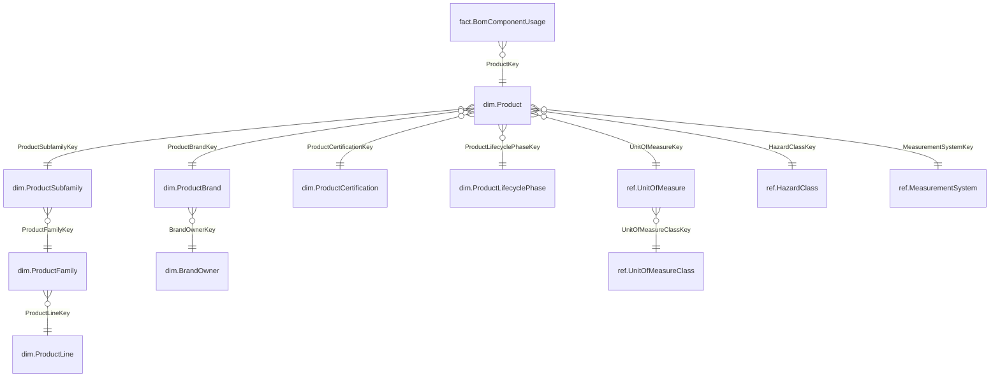

# WidestWarehouse

[](https://github.com/cbattlegear/WidestWarehouse/actions/workflows/ci.yml)
[](https://github.com/cbattlegear/WidestWarehouse/actions/workflows/docker-publish.yml)

An example SQL Server data warehouse for a large manufacturing company, built as a
**snowflake schema with 869 tables**.

The schema is not hand-written. YAML metadata in `model/` is the source of truth, a Python
generator expands every dimension hierarchy into fully normalized outrigger tables, and the
resulting `.sql` is committed to `sql/`. Starter data and a scheduled batch loader are
included, so the warehouse can be deployed, seeded, and kept moving in a few commands.

---

## What is actually in the database

| Schema   | Purpose                                                             | Tables  |
|----------|---------------------------------------------------------------------|---------|
| `ref`    | Conformed lookups (status, type, code, UOM, geography, calendar)     | 165     |
| `dim`    | 122 leaf dimensions + 248 snowflaked ancestor/outrigger tables       | 370     |
| `bridge` | Many-to-many resolvers (BOM, routing, skills, hazards, groups)       | 48      |
| `fact`   | Transaction, periodic snapshot, and accumulating snapshot facts      | 68      |
| `stg`    | Landing mirrors, derived automatically for every SCD2 dim, bridge and fact | 192 |
| `etl`    | Batch control, watermarks, audit, error, lineage, DQ results         | 26      |
| **Total**|                                                                     | **869** |

Plus **1,474 foreign keys**, all of them trusted after a seed load, and 122 flattened
`vwDim<Name>` views — one per leaf dimension — so nobody has to hand-write a nine-table join.

The table count is a consequence of the modelling rule, not the goal: **no dimension
carries its parent's attributes inline.** Every level of every hierarchy is its own table
with its own surrogate key.

### 14 subject areas

Engineering & PLM · Production Execution · Quality · Maintenance (EAM) · Equipment & OEE ·
Inventory & Warehouse · Procurement & Supplier · Sales & Order Fulfillment ·
Logistics & Shipping · Finance & Cost Accounting · HR & Labor · EHS & Compliance ·
Energy & Utilities · Warranty & Field Service

---

## What "snowflake" means here

A star schema would fold brand, family, line, and unit-of-measure attributes straight into
`dim.Product`. This model normalizes every one of them out. Below is the real, deployed
shape of the `dim.Product` branch — each box is a separate table with its own key:



The deepest chain in the model is 9 levels (`dim.MachineChangeover`). Roughly 120 leaf
dimensions at an average depth of ~3 is what produces 700+ tables honestly.

### Conventions

- **Keys** — `INT IDENTITY` surrogate `<Table>Key`; the natural/business key is kept and
  uniquely indexed. Every `ref`, `dim`, and `bridge` table has a `-1` "Unknown" row.
- **SCD** — Type 2 on volatile leaf dimensions (`EffectiveFromUtc` / `EffectiveToUtc` /
  `IsCurrent` / `RowHash`), Type 1 on ancestors and outriggers.
- **Facts** — narrow, integer FKs only, no descriptive attributes. Every fact carries
  `BatchId`, `LoadedAtUtc`, and `SourceSystemKey`, and every fact FK column defaults to `-1`.
- **Constraints** — emitted in a separate ordered pass (`50_constraints`) so table creation
  order never matters and seeding stays fast.
- **Naming** — `PascalCase`, singular table names, `FK_<child>_<parent>`, `IX_<table>_<cols>`.

The binding rules the generator and every model file must obey live in
[`model/SPEC.md`](model/SPEC.md); the shared cross-area namespace is in
[`model/CONFORMED.md`](model/CONFORMED.md).

---

## ⚠️ `sql/` and `seed/` are generated output

**Never hand-edit anything under `sql/` or `seed/`.** Both folders are committed so the
warehouse can be deployed without a Python toolchain, but they are overwritten wholesale on
the next generator run. Schema changes are made in `model/*.yaml` and re-emitted:

```powershell
.\scripts\rebuild_model.ps1
```

---

## Repository layout

```
model/                    YAML metadata — the source of truth
  SPEC.md                 binding YAML <-> generator contract
  CONFORMED.md            shared conformed dimensions and anti-collision naming
  common/                 shared types, ref lookups, date dimensions
  subject_areas/*.yaml    14 subject areas
tools/generator/          model loader, validator, DDL/index/view emitters, CLI
tools/seeder/             deterministic starter-data emitter (CSV + BULK INSERT)
tools/tests/              generator unit tests
sql/                      GENERATED. build_all.sql + 00_database .. 95_seed
seed/                     GENERATED. starter-data CSVs
loader/                   scheduled batch-load container (Python + APScheduler)
scripts/                  rebuild_model.ps1, deploy.ps1, verify_schema.sql, count_tables.sql
```

---

## Getting started

### Prerequisites

- SQL Server 2019+ (any edition) that you control — the compose file does **not** ship one.
- `sqlcmd` on `PATH` (`winget install Microsoft.Sqlcmd`).
- Python 3.12+ (only to regenerate the model or run the tests).
- Docker (only for the loader).

### 1. Deploy the schema and seed data

```powershell
$env:DW_PASSWORD = '<your sa password>'
.\scripts\deploy.ps1 -Server 'localhost,1433' -User sa -TrustServerCertificate -Force -Confirm:$false
```

`deploy.ps1` creates the database, runs `sql/build_all.sql`, executes the generated seed
manifest, and asserts the table count. A full run takes roughly two minutes and loads
about 646,000 seed rows.

> **`BULK INSERT` reads files from the *server's* filesystem.** If SQL Server is remote or
> containerised, make `seed/` visible to it and point the script at that path:
> `-SeedRoot '/var/opt/mssql/seed'` (or set `DW_SEED_SERVER_ROOT`).

Useful switches: `-Database <name>` to target a different database, `-SkipSeed` for schema
only, `-IntegratedSecurity` for Windows auth.

### 2. Verify

```powershell
sqlcmd -S 'localhost,1433' -U sa -C -b -d WidestWarehouse -i scripts\verify_schema.sql
```

This asserts 700+ base tables, that every foreign key is present **and trusted**, that every
`ref`/`dim`/`bridge` table has a primary key, that every dimension has its `-1` Unknown
member, and that every fact FK column defaults to `-1`. It exits non-zero on any failure.

> `BULK INSERT` always leaves constraints `NOT TRUSTED`, so the seed manifest ends with
> `9999_recheck_constraints.sql`, which re-validates all 1,474 foreign keys. That step is
> what proves the generated seed data is referentially sound.

### 3. Run the batch loader

```powershell
cd loader
Copy-Item .env.example .env    # then edit DW_SERVER / DW_USER / DW_PASSWORD
docker compose up -d --build
docker compose logs -f
```

Compose runs **one service: the loader**. It connects out to the SQL Server you deployed in
step 1.

To run the published image instead of building locally, set `LOADER_IMAGE` before
`docker compose up`:

```powershell
$env:LOADER_IMAGE = 'ghcr.io/cbattlegear/widestwarehouse-loader:latest'
docker compose pull
docker compose up -d --no-build
```

Images are built and pushed to GHCR by
[`.github/workflows/docker-publish.yml`](.github/workflows/docker-publish.yml) on every push
to `main` and on `v*` tags, tagged with the branch, the commit SHA, the semver version, and
`latest`. Pull requests build the image to validate the Dockerfile but never publish.

---

## The batch loader

`python:3.12-slim` + `msodbcsql18` + `pyodbc` + APScheduler. Scheduling is in-process
(cron expressions evaluated in UTC), not `cron`.

| Job            | Default schedule | What it does |
|----------------|------------------|--------------|
| `pipeline`     | `*/15 * * * *`   | `generate_batch` → `load_staging` → `merge_dimensions` → `load_facts`, all in one transaction |
| `data_quality` | `0 * * * *`      | Row counts and orphan-FK scans; results to `etl.DqResult` |
| `housekeeping` | `0 2 * * *`      | Purges old landing files and applies retention |
| `analytics`    | `*/5 * * * *`    | Runs randomized read-only BI queries and logs their timings |

Each cycle:

1. **`generate_batch`** synthesizes a plausible incremental batch into
   `/data/landing/<batch_id>/`. Surrogate-key columns are sampled from the *actual* parent
   tables so generated rows are referentially valid rather than random integers.
2. **`load_staging`** truncates and reloads the `stg` mirrors.
3. **`merge_dimensions`** MERGEs dimensions, closing out and re-inserting SCD2 rows and
   logging every change to `etl.ScdChangeLog`.
4. **`load_facts`** resolves each fact FK by natural key against the current dimension row,
   falling back to `-1`, and records lookup misses to `etl.DqResult`.

Everything is wrapped in `etl.BatchRun` / `etl.BatchRunStep`, guarded by an application lock
so overlapping runs are impossible, and idempotent — a re-run of a batch id deletes and
reloads its own rows. Failures roll back and land in `etl.LoadError`.

Configuration lives in `loader/.env` (see `.env.example`); `RUN_ON_STARTUP=true` triggers an
immediate cycle, and the container `HEALTHCHECK` verifies database connectivity.

### Randomized analytics workload

The `analytics` job simulates BI users browsing the warehouse. It reads the SQL Server
catalog, picks a random fact table, walks 1–3 random foreign-key branches up to four levels
into the snowflake, and assembles one of three query shapes:

| Shape              | Looks like |
|--------------------|------------|
| `aggregate_rollup` | Grouped `SUM`/`AVG`/`MIN`/`MAX` over the fact measures, sometimes with a `HAVING` |
| `top_n_measure`    | The same rollup ordered by a measure, `TOP (10\|25\|50\|100)` |
| `distinct_count`   | Row counts plus `COUNT(DISTINCT ...)` per attribute combination |

Roughly half the queries also get a date-key `BETWEEN` filter anchored on the server's
current year, so the window always overlaps freshly loaded data.

The job is deliberately different from the others:

- **Read-only by construction** — no tables are written, no result sets are persisted, and
  the connection is rolled back when the run ends.
- **Lock-free** — it does not take the pipeline application lock or write `etl.BatchRun`, so a
  slow analytical query can never block or delay a load cycle.
- **Failure-isolated** — one bad query is logged with its full SQL and the run continues.

Every identifier comes from the catalog, so the generated SQL always matches the deployed
schema. Each query logs an `analytics_query_completed` event with its shape, fact table,
snowflake depth, `duration_ms`, and `row_count`; the run ends with an `analytics_completed`
summary. Set `ANALYTICS_SEED` to an integer to replay the exact same query set — useful when
you want a repeatable benchmark rather than a random one.

```powershell
docker compose logs -f loader | Select-String analytics_query_completed
```

---

## Development

```powershell
pip install -r tools\requirements.txt
python -m tools.generator.cli validate     # model validation only
python -m tools.generator.cli stats        # table budget by schema
python -m tools.generator.cli emit         # regenerate sql\
python -m pytest tools\tests loader\tests -q
```

The validator rejects duplicate table names across schemas, unresolved FK targets, cycles in
the dimension graph, and reserved words, so a bad model fails before any SQL is written.

---

## Notes and known limitations

- **Regeneration is the workflow.** Editing `sql/` by hand is silently lost on the next
  `rebuild_model.ps1`.
- **`build_all.sql` must be run from the `sql/` directory.** Its `:r` includes resolve
  against the current working directory, not the script's location. `deploy.ps1` handles
  this; a manual `sqlcmd -i` from elsewhere will fail with "Invalid filename".
- **`build_all.sql` requires `-v DatabaseName="..."`.** The default is deliberately *not*
  `:setvar` inside the script, because a `:setvar` would override the command-line value and
  make the target database unchangeable.
- **`sqlcmd` variable values must be quoted** when they contain a leading `/`, which it
  otherwise parses as an option prefix.
- The seed is deterministic (`seed=42`), so a rebuild produces byte-identical CSVs and a
  reviewable diff.
